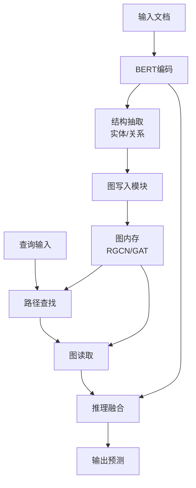

# 🧠 GDM-Net: Graph-Augmented Dual Memory Network

A neural architecture that combines explicit graph memory with dual-path processing for structured information extraction and multi-hop reasoning over documents.

## 📋 目录

1. [简介](#简介)
2. [模块架构](#模块架构)
3. [运行流水线](#运行流水线)
4. [安装依赖](#安装依赖)
5. [使用示例](#使用示例)
6. [训练指南](#训练指南)
7. [项目结构](#项目结构)

---

## 📖 简介

GDM-Net 是一个端到端可训练的神经网络架构，专为多文档理解任务设计，如关系抽取、问答和推理。其核心特性包括：

- ✨ **显式图内存读写**：利用图结构（如知识图谱）作为外部记忆
- 🔗 **双通路处理**：同时支持结构抽取和路径推理
- ⚙️ **端到端训练**：所有模块可微分，支持联合优化
- 🔄 **通用性强**：兼容 Transformer、GNN、NeSy 等多种组件

---

## 🧩 模块架构

### 核心组件

```
+------------------+        +-------------------------+
|  多文档输入段落  |---->---|  基础Encoder (e.g., BERT) |
+------------------+        +-------------------------+
                                     |
                                     v
                         +-----------------------+
                         | Structure Extractor   |<-----+
                         |  (Entity/Rel/Trigger) |      |
                         +-----------------------+      |
                                     |                  |
               +---------------------+------------------+
               |                                        |
        +--------------+                       +----------------+
        | 写入显式图记忆 |<--------------------|  推理路径模块  |
        |  (Graph Mem) |                       | (PathFinder)   |
        +--------------+                       +----------------+
               |                                        |
        +--------------+                       +----------------+
        | 图结构读取模块 |-------------------->|  推理融合输出  |
        +--------------+                       +----------------+
```

### 模块详解

| 模块 | 功能 |
|------|------|
| **DocumentEncoder** | 使用 BERT 编码输入文档 |
| **StructureExtractor** | 提取实体、关系等结构信息 |
| **GraphMemory** | 图神经网络（RGCN/GAT）维护图结构 |
| **GraphWriter** | 将结构信息写入图内存 |
| **PathFinder** | 在图中查找推理路径 |
| **GraphReader** | 根据查询从图中读取相关信息 |
| **ReasoningFusion** | 融合文档表示和图表示进行最终预测 |

---

## ▶️ 运行流水线



---

## 🛠 安装依赖

```bash
pip install torch transformers torch-geometric
pip install pytorch-lightning
pip install datasets
```

---

## 🚀 使用示例

### 模型初始化

```python
from gdmnet import GDMNet

model = GDMNet(
    bert_model_name='bert-base-uncased',
    hidden_size=768,
    num_entities=10,
    num_relations=20,
    num_classes=5
)
```

### 前向传播

```python
import torch

# 模拟输入
input_ids = torch.randint(0, 30000, (2, 512))  # [batch_size, seq_len]
attention_mask = torch.ones_like(input_ids)
query = torch.randn(768)  # 查询向量

# 前向传播
logits = model(input_ids, attention_mask, query=query)
print(f"Output logits shape: {logits.shape}")
```

---

## 🏋️ 训练指南

### 数据格式要求

```json
{
  "documents": ["doc1 text", "doc2 text"],
  "entities": [{"span": [0, 3], "type": "PERSON"}, ...],
  "relations": [{"head": 0, "tail": 1, "type": "WORKS_FOR"}, ...],
  "query": "Who is the CEO of Apple?",
  "answer": "Tim Cook"
}
```

### 训练脚本示例

```python
from torch.utils.data import DataLoader
import pytorch_lightning as pl

# 假设已定义 dataset 和 dataloader
train_loader = DataLoader(train_dataset, batch_size=4, shuffle=True)

# 初始化模型
model = GDMNet()

# 初始化训练器
trainer = pl.Trainer(
    max_epochs=10,
    gpus=1,
    precision=16
)

# 开始训练
trainer.fit(model, train_loader)
```

---

## 📁 项目结构

```
gdm-net/
├── README.md
├── gdmnet/
│   ├── __init__.py
│   ├── encoder.py          # DocumentEncoder
│   ├── extractor.py        # StructureExtractor
│   ├── graph_memory.py     # GraphMemory, GraphWriter
│   ├── reasoning.py        # PathFinder, GraphReader, ReasoningFusion
│   └── model.py            # GDMNet 主模型
├── examples/
│   └── example_usage.py
├── train/
│   ├── train.py
│   └── dataset.py
├── requirements.txt
└── config/
    └── model_config.yaml
```

---

## 🧪 模块结构草图代码

### 主模型结构

```python
import torch
import torch.nn as nn
from transformers import BertModel
from torch_geometric.nn import RGCNConv
from torch_geometric.data import Data

# ----------------------------
# 1. 基础 Encoder（BERT）
# ----------------------------
class DocumentEncoder(nn.Module):
    def __init__(self, model_name='bert-base-uncased'):
        super().__init__()
        self.bert = BertModel.from_pretrained(model_name)

    def forward(self, input_ids, attention_mask):
        outputs = self.bert(input_ids=input_ids, attention_mask=attention_mask)
        return outputs.last_hidden_state  # [B, seq_len, H]

# ----------------------------
# 2. 结构抽取模块
# ----------------------------
class StructureExtractor(nn.Module):
    def __init__(self, hidden_size, num_entities, num_relations):
        super().__init__()
        self.entity_classifier = nn.Linear(hidden_size, num_entities)
        self.relation_classifier = nn.Linear(hidden_size * 2, num_relations)

    def forward(self, sequence_output):
        entities = self.entity_classifier(sequence_output)
        # 简化的关系抽取逻辑
        batch_size, seq_len, _ = sequence_output.shape
        relations = self.relation_classifier(
            torch.cat([
                sequence_output.unsqueeze(2).expand(-1, -1, seq_len, -1),
                sequence_output.unsqueeze(1).expand(-1, seq_len, -1, -1)
            ], dim=-1).view(batch_size, -1, sequence_output.size(-1) * 2)
        )
        return entities, relations

# ----------------------------
# 3. 图内存模块
# ----------------------------
class GraphMemory(nn.Module):
    def __init__(self, node_dim=768, num_relations=10):
        super().__init__()
        self.gnn = RGCNConv(node_dim, node_dim, num_relations=num_relations)

    def forward(self, x, edge_index, edge_type):
        return self.gnn(x, edge_index, edge_type)

# ----------------------------
# 4. 图写入模块
# ----------------------------
class GraphWriter(nn.Module):
    def __init__(self, hidden_size):
        super().__init__()
        self.writer = nn.Linear(hidden_size, 768)

    def forward(self, entities, relations):
        # 简化：实体作为节点，关系作为边
        nodes = self.writer(entities.mean(dim=1))  # [B, H]
        # 构造边的伪代码
        edge_index = torch.randint(0, nodes.size(0), (2, 10))  # 示例边
        edge_type = torch.randint(0, 5, (10,))  # 示例边类型
        return nodes, edge_index, edge_type

# ----------------------------
# 5. 推理路径模块
# ----------------------------
class PathFinder(nn.Module):
    def __init__(self, gnn_model):
        super().__init__()
        self.gnn = gnn_model

    def forward(self, graph_data, query_emb):
        node_emb = self.gnn(graph_data.x, graph_data.edge_index, graph_data.edge_type)
        path_attn = torch.softmax(torch.matmul(node_emb, query_emb.unsqueeze(-1)), dim=0)
        path_repr = torch.sum(path_attn * node_emb, dim=0)
        return path_repr

# ----------------------------
# 6. 图读取模块
# ----------------------------
class GraphReader(nn.Module):
    def __init__(self):
        super().__init__()

    def forward(self, node_emb, query):
        attn = torch.softmax(torch.matmul(node_emb, query.unsqueeze(-1)), dim=0)
        read_vec = torch.sum(attn * node_emb, dim=0)
        return read_vec

# ----------------------------
# 7. 推理融合模块
# ----------------------------
class ReasoningFusion(nn.Module):
    def __init__(self, hidden_size, num_classes):
        super().__init__()
        self.fusion = nn.Linear(hidden_size * 2, hidden_size)
        self.output_proj = nn.Linear(hidden_size, num_classes)

    def forward(self, doc_repr, graph_repr):
        fused = torch.cat([doc_repr, graph_repr], dim=-1)
        fused = self.fusion(fused)
        logits = self.output_proj(fused)
        return logits

# ----------------------------
# 8. GDM-Net 主模型
# ----------------------------
class GDMNet(nn.Module):
    def __init__(self, bert_model_name='bert-base-uncased', hidden_size=768, 
                 num_entities=10, num_relations=20, num_classes=5):
        super().__init__()
        self.encoder = DocumentEncoder(bert_model_name)
        self.structure_extractor = StructureExtractor(hidden_size, num_entities, num_relations)
        self.graph_writer = GraphWriter(hidden_size)
        self.graph_memory = GraphMemory(node_dim=hidden_size, num_relations=num_relations)
        self.path_finder = PathFinder(self.graph_memory)
        self.graph_reader = GraphReader()
        self.reasoning_fusion = ReasoningFusion(hidden_size, num_classes)

    def forward(self, input_ids, attention_mask, query=None):
        # 编码文档
        sequence_output = self.encoder(input_ids, attention_mask)

        # 结构抽取
        entities, relations = self.structure_extractor(sequence_output)

        # 写入图结构
        nodes, edge_index, edge_type = self.graph_writer(entities, relations)

        # 图结构构建
        graph_data = Data(x=nodes, edge_index=edge_index, edge_type=edge_type)

        # 图推理路径查找
        path_repr = self.path_finder(graph_data, query)

        # 图读取
        graph_repr = self.graph_reader(nodes, query)

        # 融合文档和图表示
        doc_repr = torch.mean(sequence_output, dim=1)
        logits = self.reasoning_fusion(doc_repr, graph_repr + path_repr)

        return logits
```

---

## 📚 参考文献

- [DocRED: A Large-Scale Document-Level Relation Extraction Dataset](https://arxiv.org/abs/1906.06127)
- [HotpotQA: A Dataset for Diverse, Explainable Multi-hop Question Answering](https://arxiv.org/abs/1809.09600)
- [Modeling Relational Data with Graph Convolutional Networks](https://arxiv.org/abs/1703.06103)

---

## 📬 联系方式

如有问题或建议，请提交 Issue 或联系项目维护者。

---

*GDM-Net - 让多文档理解更加智能！🧠✨*
